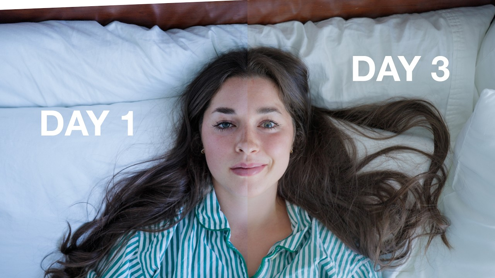
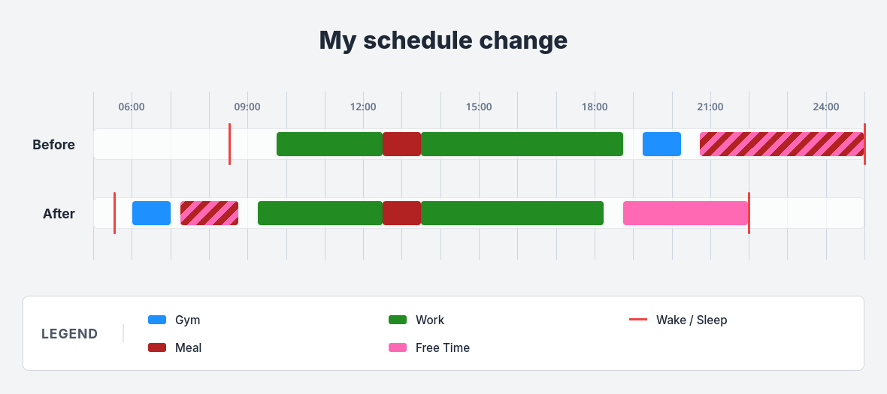

+++
title = "Fixing my life in a week"
description = "how i fixed my life thanks to a random youtube video"

date = 2026-09-17
+++

Hi again :)

## A bit of context

For a while now, my sleep schedule has been completely fucked.

I'd stay up way too late, sleep through my morning alarm, wake up late for work,
and then be unhappy with myself as I was wondering why I had no time to do
anything in the day. Evenings were not productive, and waking up felt like a
chore every day, even during the weekends where I'd already lost half the day
when I woke up.

My entire life revolved around this sleep schedule, which revolved around
basically nothing except me having a hard time waking up every morning and
delaying my bedtime every night.

Then, on the evening of September 8th, I happened to find (and watch!) this
random YouTube video:

<figure>
    
    <figcaption>It Sucks for 3 Days But It Fixes Your Sleep </figcaption>
</figure>

And, for some reason, this was exactly the thing I needed. I've been thinking
about fixing my sleep schedule for a bit already, but I never had any actual
impulse to do it. Going to sleep late had become my actual schedule and, telling
myself that I would fix this "eventually", I never really did.

Watching this video, I thought of 3 things:

- If I wake up early, I'm not pressed by time in the morning and can maybe even
  do some _actual_ things.
- If I don't go to sleep that late, I might be able to _not_ be tired when I
  wake up.
- If I go to the gym in the morning, I am _always_ able to do stuff in the
  evening, and I don't end up coming home at 10pm and eating that late.

This video wasn't magical, and I didn't really learn anything. But it gave me
the impulse I needed to do the switch now, and not wait until I "eventually"
fixed my schedule later.

## So, what actually changed?

I'm basically trying to rebuild my daily schedule around waking up early instead
of staying up late.

I just want my days to feel like actual days again.

Wake up in the morning, have breakfast, work on my projects, go outside, do
whatever I need to do, and then go to sleep at a reasonable time.

That's quite simple actually; the only hard thing is sticking to it.

For now, it's been a week that I've been following this rhythm, and it's been
fine so far. We'll see how it goes.

## How it felt

Here is how I felt some of those days. I might update that later.

- **<abbr title="September 8, 2026">Day 0</abbr>**: Went to sleep at 23:00. Just
  watched the video. Felt great.
- **<abbr title="September 9, 2026">Day 1</abbr>**: Waking up was not that hard
  actually. I had a big day at work so I didn't have the time to fall asleep as
  I was always doing something. With a work event in the evening, I also went to
  sleep at 23:00.
- **<abbr title="September 10, 2026">Day 2</abbr>**: Lighter day today. Waking
  up was the same as the day before; not too hard. It's funny how your body
  unstiffens during the day, and going to the gym in the morning is definitely a
  strange experience for me. At least, there's no one there! Also went to sleep
  at 23:00 as I had something to do in the evening.
- **<abbr title="September 11, 2026">Day 3</abbr>**: I actually woke up by
  myself before my alarm! That was quite a hassle because that means I didn't
  sleep the full night, and I sadly couldn't go back to sleep for some reason.
  At least, this must mean that my body is adapting to the new rhythm and trying
  to wake up at the _correct_ time. No workout this morning allowed me to write
  this article, actually :)
- **<abbr title="September 12, 2026">Day 4</abbr>**: First weekend day! Thing
  is, that doesn't really change anything. Woke up at 5:30, like "usual". My
  family was a bit puzzled with this sudden change but everything was alright.
- **<abbr title="September 15, 2026">Day 7</abbr>**: This was a rest day, but I
  still woke up early. TO be honest, I didn't even need the alarm today, I woke
  up by myself at around 5:00 and waited a bit to get up. It looks like my brain
  and body are adapting to the new routine so that's cool.
- **<abbr title="September 17, 2026">Day 9</abbr>**: One of the most tiring
  days. For some reason I was really tired this morning. Otherwise, I'm pretty
  happy about this experiment. I believe I can continue with this routine, so
  I'll see where that takes me.

## Impulse and procrastination

I find it funny how my brain works. As I was told by a colleague, I'm kind of
like a dam. It's either 100% in or 100% out, no in between.

That kinda means I will often just not do or fix anything that's going on, and
procrastinate as much as possible on everything. But I just _need_ the right
impulse: I am usually okay with discipline; I just lack motivation to start. I
knew for months (years, even) that I needed to do something, but I never brought
myself to do anything. And all it took was a single 10min video...

In any case, the real challenge will be to stick to this for a month, and then
continue. I read that habits take 2-3 months to develop, so we'll see where I am
by the end of 2026.
